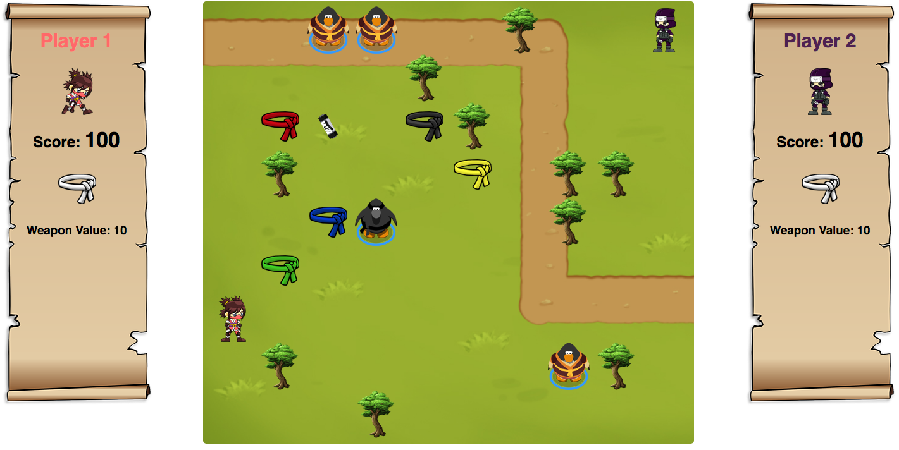

# Create an online game written in JavaScript
## FrontEnd Web Developer Project 6
### JavaScript, JQuery, HTML5, CSS3


* Create an online game written in JavaScript in which 2 players play each turn to compete. 
* Randomly generate the game map
* Weapons will be placed randomly and can 
* The placement of the two players is also randomly on the map when the game loads
* For each turn, a player can move from one to three boxes (horizontally or vertically) before ending their turn. They obviously can not pass through obstacles directly
* If a player passes over a box containing a weapon, they leave their current weapon on site and replace it with the new one
* If players cross over adjacent squares (horizontally or vertically), a battle begins.
* Each player attacks in turn
* The damage depends on the player's weapon
* The player can choose to attack or defend against the next shot
* If the player chooses to defend themselves, they sustain 50% less damage than normal
* As soon as the life points of a player (initially 100) falls to 0, they lose. A message appears and the game is over.

#### By Debbie O'Brien
5 September 2017


###Play the Game by clicking the link
https://debs-obrien.github.io/JavaScript-Game-OpenClassRooms-Project-6/



###Example Code
```javascript
function Avatar(active, notActive, attack, win, dead) {
    this.active = active;
    this.notActive = notActive;
    this.attack = attack;
    this.win = win;
    this.dead = dead;
}
/*--------------------------------------------------------------------------------------------
Creates the weapons and players
--------------------------------------------------------------------------------------------*/
let game = new GameBoard(boardSize);
let blackBelt = new Weapon('BlackBelt', 70, 'blackBelt weapon', 'avatarWin');
let redBelt = new Weapon('RedBelt', 60, 'redBelt weapon');
let blueBelt = new Weapon('BlueBelt', 40, 'blueBelt weapon');
let greenBelt = new Weapon('GreenBelt', 30, 'greenBelt weapon');
let yellowBelt = new Weapon('YellowBelt', 20, 'yellowBelt weapon');
let whiteBelt = new Weapon('WhiteBelt', 10, 'whiteBelt weapon');
let combat1 = new Weapon('combat1', 40, 'combat1 weapon');
let combat2 = new Weapon('combat2', 20, 'combat2 weapon');
let combat3 = new Weapon('combat3', 30, 'combat3 weapon');
let combat4 = new Weapon('combat4', 30, 'combat3 weapon');
let scroll = new Weapon('scroll', 20, 'scroll weapon');
let player1 = new Player('Player 1', 100, 'player1', 1, 'whiteBelt', 10, 'avatar');
let player2 = new Player('Player 2', 100, 'player2', 2, 'whiteBelt', 10, 'avatar');
let player1Avatar = new Avatar('src/player1-active.png', 'src/player1-not-active.png', 'src/player1-attack.png', 'src/player1-win.png', 'src/player1-dead.png');
let player2Avatar = new Avatar('src/player2-active.png', 'src/player2-not-active.png', 'src/player2-attack.png', 'src/player2-win.png', 'src/player2-dead.png');

/*--------------------------------------------------------------------------------------------
Sets the player Data boxes
--------------------------------------------------------------------------------------------*/
function setPlayerData(playerDiv, player) {
    $(playerDiv + ' .player-name').text(player.name);
    $(playerDiv + ' .score').text(player.score);
    $(playerDiv + ' .belt').addClass(player.weapon);
    $(playerDiv + ' .weapon-value').text(player.damage);
    $('#player-1-avatar').css('backgroundImage', 'url(' + player1Avatar.active + ')');
    $('#player-2-avatar').css('backgroundImage', 'url(' + player2Avatar.notActive + ')');
}
```